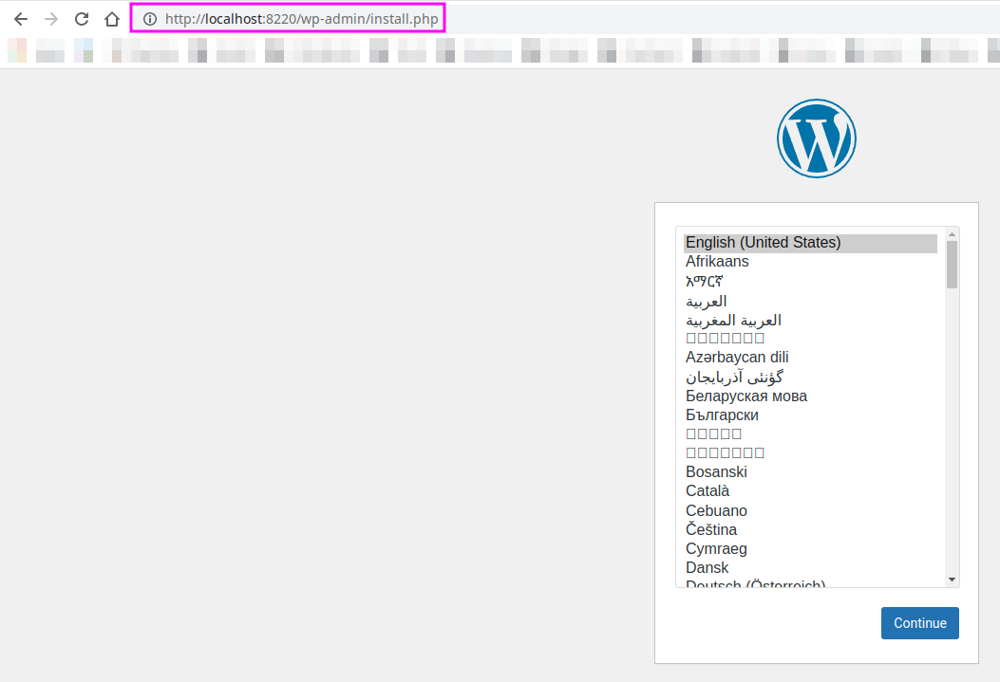
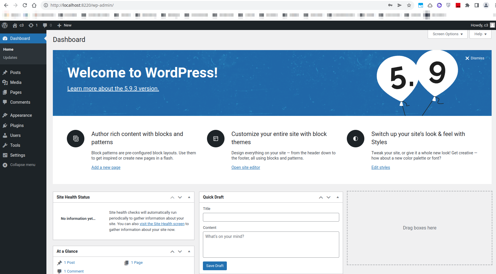
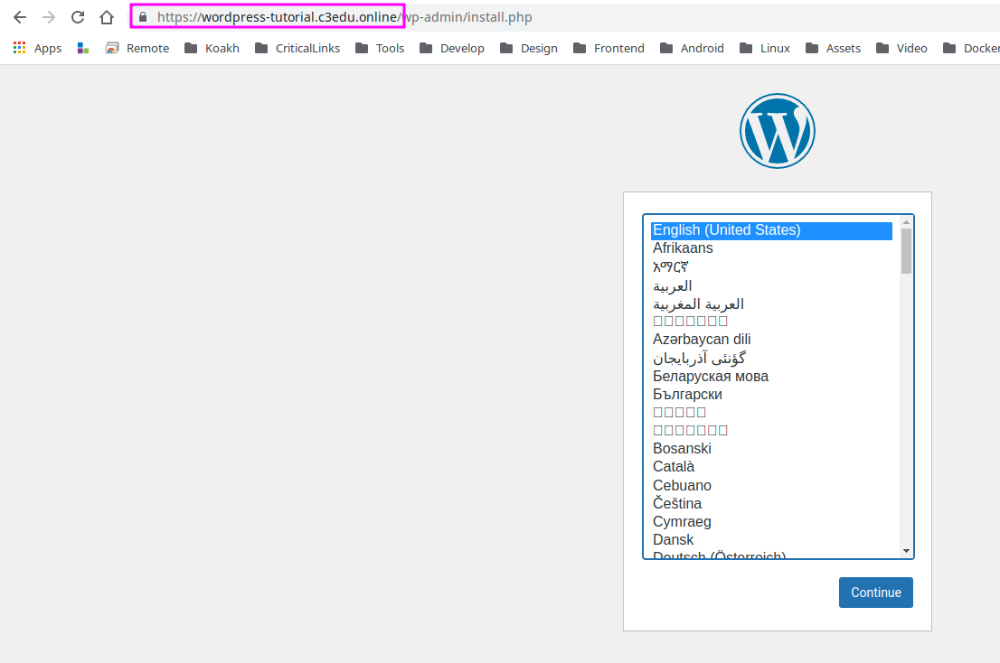

# TUTORIAL

- [TUTORIAL](#tutorial)
  - [Enter Repo Path](#enter-repo-path)
  - [Part I - Create WordPress C3App](#part-i---create-wordpress-c3app)
    - [Bootstrap boilerplate files](#bootstrap-boilerplate-files)
    - [Inspect boilerplate files](#inspect-boilerplate-files)
    - [Adapt Docker Compose file to work with Wordpress](#adapt-docker-compose-file-to-work-with-wordpress)
    - [Create External Network](#create-external-network)
    - [Test local wordpress c3App](#test-local-wordpress-c3app)
    - [Check running Services](#check-running-services)
    - [Check Logs](#check-logs)
    - [Test local c3App](#test-local-c3app)
    - [Clean up](#clean-up)
  - [Part II - Bundle and Deploy App on C3CloudControl](#part-ii---bundle-and-deploy-app-on-c3cloudcontrol)
    - [Bundle App](#bundle-app)
    - [Deploy App on a C3 device](#deploy-app-on-a-c3-device)
    - [Configure Hosts File](#configure-hosts-file)
    - [Install and Run c3App](#install-and-run-c3app)
  - [Part III - App Files Location](#part-iii---app-files-location)
  - [Part IV - Uninstall App and CleanUp](#part-iv---uninstall-app-and-cleanup)
    - [In C3 Device](#in-c3-device)
    - [In Development Machine](#in-development-machine)
  - [Final Notes](#final-notes)

## Enter Repo Path

after cloned repo <https://github.com/critical-links/c3-apps-starter.git> in [README](README.md), we must enter cloned folder path and start form here

```shell
# enter path
$ cd ~/c3-apps-starter
```

## Part I - Create WordPress C3App

### Bootstrap boilerplate files

first we need to run `./bootstrapNewApp.sh` script to bootstrap boilerplate files to work with

```shell
# bootstrap c3app
$ ./bootstrapNewApp.sh wordpress-tutorial 8280
```

> Note: `wordpress-tutorial/` was previously added to `.gitignore`, with that git will not track `wordpress-tutorial` changes

> Note: argument `8280` will be our http exposed port

### Inspect boilerplate files

after use `./bootstrapNewApp.sh` script we can check that we have bellow file system structure created

```shell
wordpress-tutorial/                                          c3app root folder
├── app.env                                                  c3app environment variables config
├── bundle.env                                               c3app environment variables used by bundle script
├── etc                                                      files that will be deployed on c3 /etc folder
│   ├── apache2                                              apache config files
│   │   └── sites-available                                  apache sites-available config files
│   │       ├── c3app-wordpress-tutorial.com-le-ssl.conf     apache https config file
│   │       └── c3app-wordpress-tutorial.conf                apache http forword config file
│   └── monit                                                monit config files
│       └── conf-available                                   monit conf-available config files
│           └── host-c3app-wordpress-tutorial                monit host config file
├── srv                                                      files that will be deployed on c3 /srv folder
│   └── docker                                               c3 docker root folder
│       └── thirdparty                                       c3 docker third party root folder
│           └── wordpress-tutorial                           c3app docker root folder
│               └── docker-compose.yml                       c3app docker-compose.yml file
└── VERSION                                                  c3app version used in bundle script
```

### Adapt Docker Compose file to work with Wordpress

- [Docker Hub](https://hub.docker.com/_/wordpress)

open `wordpress-tutorial/srv/docker/thirdparty/wordpress-tutorial/docker-compose.yml`

and replace it's contents with

`wordpress-tutorial/srv/docker/thirdparty/wordpress-tutorial/docker-compose.yml`

```yml
version: '3.1'

services:

  wordpress:
    image: wordpress
    hostname: wordpress-tutorial
    domainname: c3
    container_name: c3app_wordpress-tutorial_frontend
    restart: always
    environment:
      WORDPRESS_DB_HOST: db
      WORDPRESS_DB_USER: wordpress
      WORDPRESS_DB_PASSWORD: wordpress-password
      WORDPRESS_DB_NAME: wordpress
    volumes:
      - /etc/localtime:/etc/localtime:ro
    ports:
      - "${PORT_HTTP:-8084}:80"
    depends_on:
      - db
    networks:
      - c3app-wordpress-tutorial-network

  db:
    image: mysql:5.7
    hostname: mysql
    domainname: c3
    container_name: c3app_wordpress-tutorial_db
    restart: always
    volumes:
      - /etc/localtime:/etc/localtime:ro
      - ./volumes/db/var/lib/mysql:/var/lib/mysql
    environment:
      MYSQL_DATABASE: wordpress
      MYSQL_USER: wordpress
      MYSQL_PASSWORD: wordpress-password
      MYSQL_RANDOM_ROOT_PASSWORD: 1
    networks:
      - c3app-wordpress-tutorial-network

networks:
  c3app-wordpress-tutorial-network:
    external: true
```

we opted to exposed http port in environment variables **in an external file** `.env`, this file was created on bootstrap c3app generation, if one want to change exposed port this is the right place to do that, just change `8280` for desired port ex `8080`

`wordpress/srv/docker/thirdparty/wordpress-tutorial/.env`

```bash
PORT_HTTP="8280"
```

### Create External Network

```shell
# create external network
$ docker network create c3app-wordpress-tutorial-network
b599810ef7c3464c3335cfe6d2723834d07ccb6839da3cb307e02b87c32894fc
# check network
$ docker network ls | grep c3app-wordpress-tutorial-network
43b3f7ee833d   c3app-wordpress-tutorial-network   bridge    local
```

### Test local wordpress c3App

```shell
# enter path
$ cd wordpress-tutorial/srv/docker/thirdparty/wordpress-tutorial

# optional: if previously spin the stack, is better to do some tear down/clean up work first to prevent stalled files and docker stuff
$ docker-compose down --remove-orphans | true  && sudo rm volumes/ -R | true

# spin docker compose stack
$ docker-compose up -d
# outcome, downloading images, will occur first time only
Pulling wordpress (wordpress:)...
...
latest: Pulling from library/wordpress
...
Status: Downloaded newer image for wordpress:latest
...
Pulling db (mysql:5.7)
...
5.7: Pulling from library/mysql
...
Status: Downloaded newer image for mysql:5.7
```

### Check running Services

```shell
$ docker ps | grep c3app_wordpres
# outcome
b13a29fb00e4   wordpress              "docker-entrypoint.s…"   24 seconds ago   Up 23 seconds   0.0.0.0:8280->80/tcp, :::8280->80/tcp           c3app_wordpress-tutorial_frontend
df6ba1cb67f8   mysql:5.7              "docker-entrypoint.s…"   25 seconds ago   Up 24 seconds   3306/tcp, 33060/tcp                             c3app_wordpress-tutorial_db
```

### Check Logs

```shell
# optional check logs
$ docker-compose logs -f
```

### Test local c3App

open browser and connect to [http://localhost:8280](http://localhost:8280), if everything works has expected we are redirected to wordpress admin install page



here we follow the install configuration steps as usual

after we finish install, we have a proper wordpress installation, connected to a mysql datastore



### Clean up

if we leave stack running, before next steps, **Bundle and Deploy App**, we need to do some clean up

```shell
# enter path if not already in
$ cd wordpress-tutorial/srv/docker/thirdparty/wordpress-tutorial
$ docker-compose down --remove-orphans | true  && sudo rm volumes/ -R | true
```

## Part II - Bundle and Deploy App on C3CloudControl

### Bundle App

in c3-apps-starter repo root path launch `./bundleApp.sh` script, to bundle c3App in a standalone c3app passing the c3app id ex `wordpress-tutorial`

```shell
# bundle c3app
$ ./bundleApp.sh wordpress-tutorial
# outcome
done with wordpress-tutorial bundle.
# check bundle c3app
$ ls -la @deploy-versions/wordpress-tutorial/
# outcome
-rw-r--r-- 1 mario users 5666 May 16 17:08 wordpress-tutorial_1.0.0.c3app
```

done we have a bundle with our c3 c3app `wordpress-tutorial_1.0.0.c3app`

### Deploy App on a C3 device

to deploy/simulate a c3cloudcontrol/syncthing installation one can use `pushToC3.sh` script

first we need to know the ip address of our c3, or use it's domain for ex `c3edu.online`, in our case we use domain name `c3edu.online`
if our c3 **only responds to a specific ip** we must tweak `pushToC3.sh` script to change its default `C3_ADDRESS`

we can test communication with a simple

```shell
# test ssh connection
$ ssh c3@c3edu.online
# or use a specific ip for ex
$ ssh c3@192.168.1.120
```

some variables that we can tweak in `pushToC3.sh`

```bash
# user variables
C3_ADDRESS="c3@c3edu.online"
C3_PASS="root"
SYNCTHING_APP_DIR="008280"
```

> Note: `SYNCTHING_APP_DIR` is just a fake syncthing folderId

after we have connection we can deploy c3app on our c3

> Tip: we must use our c3app name id and version, we can get it from bundle filename ex `wordpress-tutorial_1.0.0.c3app`

```shell
# bundle and deploy c3app on c3
$ ./pushToC3.sh wordpress-tutorial 1.0.0

done, now to install and uninstall c3app, launch bellow scripts in path /tmp/c3apps

  # 1. connect to c3 via ssh
  ssh c3@c3edu.online

  # 2. enter path
  cd /tmp/c3apps

  # 3. install c3app
  sudo ./syncthingInstall.sh wordpress-tutorial 008280

  # 4. uninstall app
  sudo ./syncthingUninstall.sh 008280
```

### Configure Hosts File

before start execute the suggested commands, we need to `hack` our hosts file to simulate c3app dns domain `wordpress-tutorial.c3edu.online`
what this means is that c3app work with reverse proxy and samba dns cnames, if we are connected to a c3 network we can access the c3app just using that domain in browser for ex `https://wordpress-tutorial.c3edu.online` and it simply works, but in our current development environment we are connected to a non c3 network, and to test reverse proxy we must edit our `/etc/hosts` file in our workstation/laptop (machine where we use the browser)

in our case our c3 have the ip `192.168.1.120` we can get it's ip with

```shell
# get ip address
$ ssh -t c3@c3edu.online "ip addr show eth0" | grep inet
# outcome
2: eth0: <BROADCAST,MULTICAST,UP,LOWER_UP> mtu 1500 qdisc fq_codel state UP group default qlen 1000
    inet 192.168.1.120/24 brd 192.168.1.255 scope global dynamic eth0
```

> Note: we can see the ip address `inet 192.168.1.120/24` on outcome

now add domain to hosts file

```shell
# edit hosts file
$ sudo nano /etc/hosts
```

add `192.168.1.120   wordpress-tutorial.c3edu.online` to bottom of file

`/etc/hosts`

```
192.168.1.120   wordpress-tutorial.c3edu.online
```

```shell
# confirm domain response
$ ping wordpress-tutorial.c3edu.online
# outcome
64 bytes from c3edu.online (192.168.1.120): icmp_seq=1 ttl=64 time=0.140 ms
64 bytes from c3edu.online (192.168.1.120): icmp_seq=2 ttl=64 time=0.259 ms
```

if domain response successfully we can start to install and test c3app

### Install and Run c3App

we will follow suggested lines from `./pushToC3.sh wordpress-tutorial 1.0.0` outcome script

```shell
  # 1. connect to c3 via ssh
  ssh c3@c3edu.online

  # 2. enter path
  cd /tmp/c3apps

  # 3. install c3app
  sudo ./syncthingInstall.sh wordpress-tutorial 008280

  # 4. uninstall c3app
  sudo ./syncthingUninstall.sh 008280
```

first we must connect to c3 device

```shell
$ ssh c3@c3edu.online
   Welcome to 5.0.0 ( running on 192.168.1.120 )

   Installation base version: 5.0.0
...

# enter temp path
$ cd /tmp/c3apps
# install c3app
$ sudo ./syncthingInstall.sh wordpress-tutorial 008280
# outcome
  extracting VERSION from /data/syncthing/data/008280/wordpress-tutorial_1.0.0.c3app to /var/lib/c3apps/008280
  extracting enable.sh from /data/syncthing/data/008280/wordpress-tutorial_1.0.0.c3app to /var/lib/c3apps/008280
  extracting disable.sh from /data/syncthing/data/008280/wordpress-tutorial_1.0.0.c3app to /var/lib/c3apps/008280
  extracting install.sh from /data/syncthing/data/008280/wordpress-tutorial_1.0.0.c3app to /var/lib/c3apps/008280
  extracting uninstall.sh from /data/syncthing/data/008280/wordpress-tutorial_1.0.0.c3app to /var/lib/c3apps/008280
  extracting app.env from /data/syncthing/data/008280/wordpress-tutorial_1.0.0.c3app to /var/lib/c3apps/008280
  extracting common.env from /data/syncthing/data/008280/wordpress-tutorial_1.0.0.c3app to /var/lib/c3apps/008280
  extracting data.json from /data/syncthing/data/008280/wordpress-tutorial_1.0.0.c3app to /var/lib/c3apps/008280
install wordpress-tutorial...
check if target directories exist...
  unpack package files to file system...
docker network c3app-wordpress-tutorial-network
  skip creating network c3app-wordpress-tutorial-network
enable wordpress-tutorial...
  save service state
  activate apache reverse proxy wordpress-tutorial.c3edu.online...
  add dns entry wordpress-tutorial.c3edu.online...
Record added successfully
  run docker stack
Pulling db (mysql:5.7)...
5.7: Pulling from library/mysql
c32ce6654453: Pull complete
415d08ee031a: Pull complete
7a38fec2542f: Pull complete
352881ee8fe9: Pull complete
b8e20da291b6: Pull complete
66c2a8cc1999: Pull complete
d3a3a8e49878: Pull complete
172aabfba65c: Pull complete
fea17d0b1d1e: Pull complete
fff7f5411ca9: Pull complete
c33d43428e07: Pull complete
Digest: sha256:16e159331007eccc069822f7b731272043ed572a79a196a05ffa2ea127caaf67
Status: Downloaded newer image for mysql:5.7
Pulling wordpress (wordpress:)...
latest: Pulling from library/wordpress
214ca5fb9032: Pull complete
cd813a1b2cb8: Pull complete
63cf7574573d: Pull complete
54c27146d16e: Pull complete
078f4450f949: Pull complete
5f145e355bc4: Pull complete
fdc797cb9eea: Pull complete
0e1a880fdf19: Pull complete
b09a58fafe61: Pull complete
99a91c7abd4b: Pull complete
a561dfd0a6e4: Pull complete
9bbca95a37a8: Pull complete
3b08a964eacd: Pull complete
d678d31a4e0d: Pull complete
a56558133e81: Pull complete
407f56ae9391: Pull complete
5169a2dd75c2: Pull complete
5a4b786a36b3: Pull complete
7f028687a4a0: Pull complete
5d5119ba463f: Pull complete
55ceb3f8793b: Pull complete
Digest: sha256:f9d68493ee98ea8f39e6e0fc2327b48e0b555ef0ec3fcc06b8d42cbc539c49a4
Status: Downloaded newer image for wordpress:latest
Creating c3app_wordpress-tutorial_db ... done
Creating c3app_wordpress-tutorial_frontend ... done
  enable monit service
There is no service named "c3app-wordpress-tutorial"
  save service state
```

go to browser and navigate to <wordpress-tutorial.c3edu.online>



we see that we are redirect to https and have our c3app working

## Part III - App Files Location

- bundled c3app, in production syncthing will bring that file to this location
  - `/data/syncthing/data/008280/wordpress-tutorial_1.0.0.c3app`

- apache sites configuration
  - `/etc/apache2/sites-available/c3app-wordpress-tutorial.com-le-ssl.conf`
  - `/etc/apache2/sites-available/c3app-wordpress-tutorial.conf`

- monit configuration
  - `/etc/monit/conf-available/host-c3app-wordpress-tutorial`

- c3app bundle extracted file
  - `/var/lib/c3apps/008280/app.env`
  - `/var/lib/c3apps/008280/common.env`
  - `/var/lib/c3apps/008280/data.json`
  - `/var/lib/c3apps/008280/disable.sh`
  - `/var/lib/c3apps/008280/enable.sh`
  - `/var/lib/c3apps/008280/install.sh`
  - `/var/lib/c3apps/008280/uninstall.sh`
  - `/var/lib/c3apps/008280/VERSION`

- docker files
  - `docker-compose.yml`
  - `.env`
  - `volumes`

## Part IV - Uninstall App and CleanUp

### In C3 Device

to revert c3app installation, we use the `./syncthingInstall.sh` script, this will remove all files, docker images, volumes and networks

first we must connect to c3 device, if not already connected

```shell
$ ssh c3@c3edu.online
   Welcome to 5.0.0 ( running on 192.168.1.120 )

   Installation base version: 5.0.0
...

now procceed to uninstall c3app

```shell
# enter temp path
$ cd /tmp/c3apps
# uninstall.sh app, this time we will pass only syncthing folderId
$ sudo ./syncthingUninstall.sh 008280
# outcome
uninstall wordpress-tutorial...
  remove docker network c3app-wordpress-tutorial-network
Error response from daemon: error while removing network: network c3app-wordpress-tutorial-network id 797f123b322c06e286c0928d7492d96b4157353c43565fff423400421c1b4bc3 has active endpoints
  disable app
disable wordpress-tutorial...
  save service state
  disable apache reverse proxy wordpress-tutorial.c3edu.online...
  delete dns entry wordpress-tutorial.c3edu.online...
Record deleted successfully
  stop docker stack
Stopping c3app_wordpress-tutorial_frontend ... done
Stopping c3app_wordpress-tutorial_db       ... done
Removing c3app_wordpress-tutorial_frontend ... done
Removing c3app_wordpress-tutorial_db       ... done
Network c3app-wordpress-tutorial-network is external, skipping
  disable monit service
  save service state
  stop docker stack
Network c3app-wordpress-tutorial-network is external, skipping
Removing image mysql:5.7
Removing image wordpress
  removing files and directories...
    removing file /etc/apache2/sites-available/c3app-wordpress-tutorial.conf...
    removing file /etc/apache2/sites-available/c3app-wordpress-tutorial.com-le-ssl.conf...
    removing file /etc/monit/conf-available/host-c3app-wordpress-tutorial...
    removing directory /srv/docker/thirdparty/wordpress-tutorial/...
    removing directory /var/lib/c3apps/008280..
```

### In Development Machine

remove domain from hosts file

```shell
# edit hosts file
$ sudo nano /etc/hosts
```

remove added line `192.168.1.120   wordpress-tutorial.c3edu.online` from bottom of file

we can delete our tutorial files too, or leave it

```shell
$ rm wordpress-tutorial -R
```

## Final Notes

done! we have create a simple c3app, deploy, install and uninstall it.
